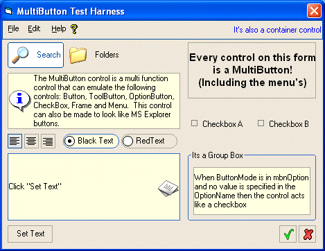



## MultiButton Control

### Description

Hi. This a control that act as a command button, option button, checkbox, frame, menu and more by setting just a couple of properties. Let me know what you think. Paul
 
### More Info
 
Before loading the project you need to rename the .oc_ file to .ocx.

             |
---                |---
**Submitted On**   |2002-07-28 15:54:40
**By**             |[Paul Sanders](https://github.com/Planet-Source-Code/PSCIndex/blob/master/ByAuthor/paul-sanders.md)
**Level**          |Intermediate
**User Rating**    |5.0 (75 globes from 15 users)
**Compatibility**  |VB 5\.0, VB 6\.0
**Category**       |[Custom Controls/ Forms/  Menus](https://github.com/Planet-Source-Code/PSCIndex/blob/master/ByCategory/custom-controls-forms-menus__1-4.md)
**World**          |[Visual Basic](https://github.com/Planet-Source-Code/PSCIndex/blob/master/ByWorld/visual-basic.md)
**Archive File**   |[MultiButto1115457282002\.zip](https://github.com/Planet-Source-Code/paul-sanders-multibutton-control__1-37325/archive/master.zip)

